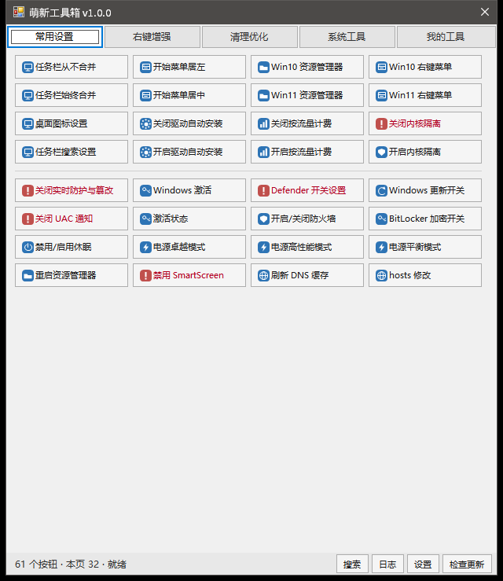
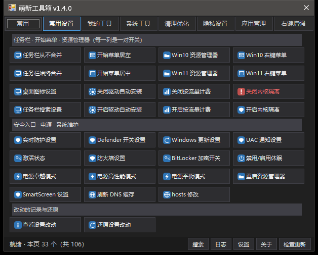
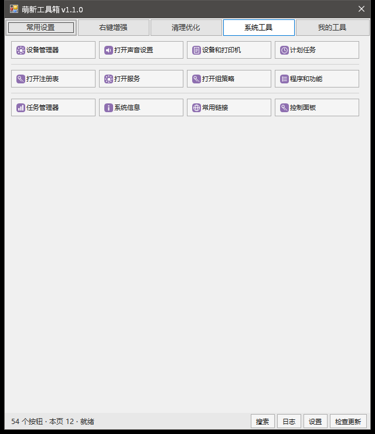

# 萌新工具箱（Mxx1Toolbox）

一个免安装的单文件 Windows 程序：**主界面是多行多列的小按钮墙，点一下按钮就启动一个已经做好的程序、脚本或功能。**



深色主题：



「系统工具」页签（彩色 = 真功能）—— 和上面那一片灰色占位按钮正好对照：



- 单文件 `Mxx1Toolbox.exe`（约 763 KB，含 114 个内嵌图标 + 免责声明正文 + 自己的程序图标），不需要 .NET SDK、不加开机启动
  （**只有你自己点的隐私/系统按钮才会写注册表，而且写之前会先把原值记下来、可以一键还原**）
- **支持 Windows 7 SP1 / 10 / 11**（32 位与 64 位都能跑）—— 运行环境与逐项兼容结论见下面「系统要求 / 兼容性」
- 八个页签：**常用 / 常用设置 / 我的工具 / 系统工具 / 清理优化 / 隐私设置 / 应用管理 / 右键增强**，
  一共 114 个内置按钮 —— **全部是真功能，没有点不动的灰按钮**
- 按钮全部由 `tools\*.json` 定义 —— **加按钮不用重新编译**
- 图标：114 个 16×16 PNG（按页签配色 + 按名字选图形，`tools\Make-Icons.ps1` 一键重生成），
  编译时内嵌进 exe；`assets\icons\<id>.png` 或清单里的 `icon` 字段可以覆盖
- **程序自己也有图标**：`assets\app.ico`（`tools\Make-AppIcon.ps1` 生成，8 个尺寸）编进 exe 资源，
  资源管理器 / 桌面快捷方式 / 任务栏 / 窗口标题栏看到的都是它（窗口那份由 `src\AppIcon.cs` 按 DPI 取）
- 浅色 / 深色 / 跟随系统三种主题，标题栏也跟着变
- **窗口默认固定尺寸**（宽度不跟着内容变，名字太长就出省略号、悬停看全名）；想让高度跟着当前页签
  的按钮变，去「设置」里勾一下就行
- **跑完必有反馈**：页签下面一条绿/红结果条（点它看运行日志）、有输出就开结果窗口、
  运行中底栏显示「运行中（已 X 秒）」
- **「常用设置」里改的注册表都能还原**：写之前先记原值，「查看设置改动」念给你听、
  「还原设置改动」一键写回去（隐私设置是同一套）
- 搜索框**搜全部八个页签**（`Ctrl+F`），结果按页签分块，点一下就运行
- **灰色按钮 = 功能还没接入**：灰底灰字 + 图标置灰，而且**禁止点击**（点不动）；状态栏会写明"灰色 N 个没接功能"。
  内置的一个灰按钮都不剩了，这条规则留给用户自己写的 `placeholder: true`
- 「右键增强」三个功能 + 隔壁工具：**「解除文件占用」**（右键一个文件 / 文件夹，看到是谁占着它，
  勾一下就能把那个程序结束掉（**连它启动的子进程一起**）—— 用 Windows 自带的 Restart Manager，
  **不装 handle.exe、不要管理员**；
  右键**文件夹**时会往下扫 4 层、最多 400 个文件，并告诉你**是哪个文件**被占着（二分定位：
  400 个文件里被占的是第 200 个也能指名，只要约 18 次查询）；没查到占用时它自己
  会试着独占打开一次，明确区分「真没人在用」/「有人占着但报不出名字」/「其实是权限问题」；
  还会顺带列两件事：**「它自己在运行」**（正在运行的程序不持有文件句柄，RM 看不见它）、
  **「窗口里开着它」**（记事本这类程序读完就关句柄，本来就没锁）；再加上**「能不能删 / 能不能改名」**
  （拿 DELETE 权限试一次 —— "被打开着"和"删不掉"不是一回事）；
  另外有 **「强制解锁（不关程序）」**：遍历全系统句柄表，把对方手里那个句柄直接关掉，**进程不动**
  （和火绒的「解锁占用」是一个思路；风险写在确认框里：句柄被关掉，那个程序可能报错 / 存不上盘）。
  那个小窗口的高度按内容自适应：查出几个程序、正文有几行，窗口就多高，不长也不切；
  **查的过程不会把窗口卡住**（扫描在后台线程，状态行上的秒数还在走，窗口随时能拖能关）。
  和 **「一键解除占用」**（**不弹窗口**的一键版：右键一下，后台查到谁占着它就**直接结束那些程序**，
  然后在**鼠标旁边弹一张小提示卡**说结果 —— 卡片不抢焦点、跟着鼠标走、几秒后自己消失、点一下就关；
  系统关键进程 / 系统服务 / 不是你自己账户的程序 / 资源管理器 / 工具箱自己一律不动，
  没同意过使用条款时一个进程都不碰）。
  和 **「常用功能」级联子菜单**（右键里多一个子菜单，放工具箱「常用」页的东西）。
  三项都只写 `HKCU\Software\Classes`，删掉键就干净；再加上**「永久删除工具」**：打开隔壁的
  [永久删除（不进回收站）](../permanent-delete-menu) 安装器窗口，零改动集成
- 「系统工具」12 个按钮**都是真功能**：设备管理器 / 声音设置 / 设备和打印机 / 计划任务 / 注册表 / 服务 /
  （Win7 上没有 Windows 10 那个「设置」应用，走 `ms-settings:` 的 7 个按钮会直接告诉你**该去控制面板哪一项**）
- **首次打开要勾一次同意**：界面第一次运行会弹《使用条款确认》（正文就是
  [`docs/DISCLAIMER.md`](docs/DISCLAIMER.md)，编译时内嵌进 exe），勾选「我已阅读并同意」之后
  「同意并继续」才可点，点「不同意，退出」程序直接关闭、**不写注册表不联网**；
  记的是**条款正文的指纹** —— 正文改了就要重新确认（命令行不被拦，脚本照旧能用）
- **更新检查**：关于窗口一行「更新」状态 + 「检查更新」按钮，底栏发现新版本会提示一句；
  **只读版本号，不下载不替换**，失败只写日志，`MXX1_NO_UPDATE=1` 能彻底关掉
- **外部工具统一放 `bin-tools\`**：隔壁的 `PermanentDeleteSetup.exe` 丢进去就能用（设置 / 关于里都有「打开工具目录」）；
  **丢进去的工具文件夹会自动长出一个按钮**（见下面「加一个按钮」第 3 条）
- **「我的工具」能自己长按钮**：图形化「+ 新建按钮」（`Ctrl+N`）、把 exe / 脚本 / 文件夹拖进窗口、右键用户按钮可编辑 / 删除

## 快速开始

```powershell
powershell -ExecutionPolicy Bypass -File build.ps1     # 编译，产物 bin\Mxx1Toolbox.exe
.\bin\Mxx1Toolbox.exe                                   # 不带参数 = 打开界面
```

## 系统要求 / 兼容性

支持范围是 **Windows 7 SP1 / Windows 10 / Windows 11**（32 位与 64 位都能跑）。

| 系统 | 先决条件 | 说明 |
| --- | --- | --- |
| **Windows 10 / 11** | 无 | 系统自带 .NET Framework 4.8，拷过去双击就能跑 |
| **Windows 7** | **SP1 + 自己装一遍 .NET Framework 4.x** | 本程序用系统自带的 `csc`（v4.0.30319）编译 → 它是 .NET 4.x 程序；Win7 只自带 3.5，**没装 4.x 时双击 exe 会看到系统那句"需要 .NET Framework"的提示**（不是程序崩了） |

已经为这三版做过的事：

- **清单里写齐了 `supportedOS`**（Win7 / 8 / 8.1 / 10）—— 漏掉老系统那条时，老系统会按"兼容模式"
  对待程序，而且程序拿到的版本号会是假的（Win8.1 以上一律报 6.2）。`status` 里的 `windows=`
  报的就是真实版本（`Windows 7` / `Windows 10` / `Windows 11`）。
- **Win11 的右键菜单是折叠的**：「右键增强」装上的项要先点**「显示更多选项」**才看得到
  （或者用「常用设置」里的「经典右键菜单」换回 Win10 那套）。
- **Win7 上没有 `ms-settings:` 这个入口**（那是 Win10 起的「设置」应用）：系统工具页那 7 个按钮
  会直接说"去控制面板的哪一项"，不会点了没反应；`status` 里能用 `settingsApp=yes|no` 查到。
- **深浅主题**：深色标题栏需要 Win10 1809 以上；Win7 上标题栏保持系统的浅色，界面其余部分照常。
- **「解除文件占用」的「强制解锁」在 32 位系统上也正确**：句柄表条目的步长/偏移随指针宽度变
  （x64 = 40 字节 / x86 = 28 字节），现在按运行时的 `IntPtr.Size` 现算。
- **不保证**：Windows 8 / 8.1、Windows Server、ARM64 仿真、XP / Vista —— 没测过就不写进支持范围。
- 测试是**按"这台机器是哪一版"分叉断言**的（`A03b` / `A03c` / `A03d` / `D01`），
  同一套测试拿到 Win7 上跑就应该全绿。逐项结论见 [`docs/DESIGN.md`](docs/DESIGN.md) §16。

## 界面怎么用

| 操作 | 结果 |
| --- | --- |
| 左键单击按钮 | 执行（**灰色按钮**点不动 —— 它是禁用的；**运行中按钮文字不变**，只有图标变成转圈） |
| 按住 Shift 单击 / 右键「以管理员身份运行」 | 提权执行（UAC） |
| 右键按钮 | 运行 / 以管理员身份运行 / **编辑按钮… / 删除按钮**（只对自己加的按钮）/ 打开所在文件夹 / 复制启动命令 / 查看按钮定义 / 新建按钮… |
| 鼠标停在按钮上 | 显示它会执行的命令（灰色按钮是禁用的，不弹提示，看状态栏） |
| 底部 `[搜索]` `[日志]` `[设置]` `[关于]` `[检查更新]` | 搜索 / 运行日志面板（**最新的在最上面**）/ 设置 / 关于（含「打开工具目录」）/ 更新检查（P2） |
| 跑完一个按钮 | 页签下面弹一条**结果条**（绿 = 成功 / 红 = 失败，8 秒后自动收，**点它看运行日志**）；有输出就开结果窗口；只有"失败且没有输出"才弹消息框 |
| `Ctrl+N` / `Ctrl+F` / `Ctrl+L` / `F5` / `Ctrl+,` | 新建按钮 / 搜索（搜全部八个页签）/ 日志 / 刷新按钮清单 / 设置 |
| 方向键 + `Enter` | 键盘走格子并执行；`Alt+1..9` 直接执行本页前九个；菜单键或 `Shift+F10` 打开右键菜单 |

## 页签与按钮

| 页签 | 数量 | 性质 |
| --- | --- | --- |
| 常用 | 0+ | 置顶的按钮 + 最近用过的 30 个（按钮上右键可以置顶；空着时页面会给一句用法说明） |
| 常用设置 | 33 | **全是真功能**（桌面图标 / 任务栏合并 ×2 / 任务栏搜索 / 开始菜单对齐 ×2 / 右键菜单风格 ×2 / 资源管理器样式 ×2 / 驱动自动安装 ×2 / 内核隔离 ×2 / 按流量计费 ×2 / 激活状态 / 休眠 / 电源模式 ×3 / 重启资源管理器 / 刷新 DNS / hosts 修改 / 实时防护·Defender·SmartScreen·防火墙·UAC·更新 六个「打开官方界面」入口 / BitLocker / **查看设置改动 / 还原设置改动**）；其中 12 个注册表开关**改之前会记原值、随时能还原** |
| 系统工具 | 26 | **真功能**（12 个 Windows 组件 + 13 个修复诊断 + 系统体检） |
| 隐私设置 | 29 | **真功能**（11 组成对开关 + 4 个权限入口 + 状态 / 一键优化 / 一键还原） |
| 应用管理 | 5 | **真功能**（查看已安装应用 / 启动项 / 默认应用 / 应用和功能 / 单个卸载 —— 卸载窗口里显示中文应用名） |
| 清理优化 | 8 | **真功能**（一键清理垃圾 / 清理临时文件 / 清空回收站 / 浏览器缓存 / 磁盘清理 / 存储感知 / 启动项 / 大文件查找） |
| 右键增强 | 8 | **真功能**：装上 / 撤掉「解除文件占用」（右键文件就能查出谁占着它：真占着的程序 / 它自己在运行 / 窗口里开着它 / 能不能删，勾一下结束那个程序或「强制解锁」抽掉它的句柄）、装上 / 撤掉「常用功能」级联子菜单、右键菜单状态、重建常用功能、右键增强说明 + 「永久删除工具」 |
| 我的工具 | 3+ | **真功能** `[+ 新建按钮]` + 导出 / 导入，加上你自己加的按钮 |

「系统工具」26 个按钮对应哪个 Windows 组件、缺组件时说什么，见
[`docs/DESIGN.md`](docs/DESIGN.md) §4.4；「右键增强」那两项怎么装进右键菜单、底线是什么，见同文件 §14；
按钮清单的正本也在那里。

## 加一个按钮

三种办法，按省事程度排：

1. **把工具文件夹丢进 `bin-tools\`** —— 按钮**自己长出来**（`auto.<文件夹名>`，落在「我的工具」页签
   「bin-tools 里的工具（自动加载）」那一段）：文件夹里只有一个 exe 就用它；想指定名字 / 图标 / 参数，
   在文件夹里放一个 `tool.json`。按 `F5` 或重启工具箱就生效，**不用改任何配置、不用重新编译**。
   这套自动按钮**只读**（右键里不能编辑 / 删除），也**绝不覆盖**你自己写的同 id 按钮。
2. 编辑 `%LOCALAPPDATA%\mxx1-toolbox\tools.json`（用户层，升级不冲掉；同 `id` 覆盖内置），
   或者往仓库的 `tools\*.json` 里加（内置按钮，要重新编译才会内嵌进 exe）；
3. 界面里点「+ 新建按钮」/ 把 exe 拖进窗口（图形化，写的就是第 2 条那个文件）。

编码必须是 **UTF-8 无 BOM**。五种按钮类型：

```json
{
  "tools": [
    { "id": "mytool.notepad", "tab": "mine", "segment": 1, "order": 10,
      "name": "记事本", "kind": "exe",
      "path": "%SystemRoot%\\system32\\notepad.exe", "args": "" },

    { "id": "mytool.folder", "tab": "mine", "segment": 1, "order": 20,
      "name": "打开下载目录", "kind": "open", "target": "%USERPROFILE%\\Downloads" },

    { "id": "mytool.script", "tab": "mine", "segment": 1, "order": 30,
      "name": "刷新 DNS", "kind": "script", "shell": "cmd",
      "inline": "ipconfig /flushdns", "runAsAdmin": true },

    { "id": "mytool.pending", "tab": "mine", "segment": 1, "order": 40,
      "name": "还没做的功能", "kind": "builtin", "placeholder": true, "hint": "P1" }
  ]
}
```

`tab` 可写 id（`recent` / `common` / `mine` / `system` / `cleanup` / `privacy` / `apps` / `rightmenu`）
或中文页签名；`segment` 决定它落在第几段（段与段之间画一条分隔线 + 一句小标题，
小标题写在**这一段第一个按钮**的 `segmentName` 里）；`order` 是段内顺序；
`danger: true` 让文字变深红并强制二次确认。

`bin-tools\<工具>\tool.json` 用的是**同一套字段**（`id` 默认 `auto.<文件夹名>`，`tab` 默认 `mine`，
`segment` 默认 2），所以把上面那段 JSON 放进工具文件夹里就能用 —— 详细规则见
[`docs/DESIGN.md`](docs/DESIGN.md) §13.7。

## 命令行

```powershell
bin\Mxx1Toolbox.exe list [--tab system]      # 列出按钮（tab 分隔：id / 页签 / 名称 / 类型）
bin\Mxx1Toolbox.exe run permdel.gui          # 执行一个按钮（和界面同一条路径）
bin\Mxx1Toolbox.exe run devmgmt --dry        # 只解析按钮指向哪里，不真的启动（看 kind/target/exists/hint/icon）
bin\Mxx1Toolbox.exe status                   # key=value 状态（版本 / 按钮数 / 自动按钮 / 系统版本 / 条款状态 / 主题 / 日志路径…）
bin\Mxx1Toolbox.exe checkupdate              # 只读版本号，不下载不替换（0 = 查过了，1 = 关掉了 / 查不成）
bin\Mxx1Toolbox.exe disclaimer               # 打印免责声明与服务条款正文（和窗口显示的一致）
bin\Mxx1Toolbox.exe consent [--accept|--reset]  # 看 / 记下 / 清掉首次运行的条款确认状态
bin\Mxx1Toolbox.exe help
```

`status` 里几个和排障有关的键：`windows=`（真实系统版本）、`settingsApp=yes|no`
（有没有 Win10 那个「设置」应用）、`autoButtons=N` 与 `autoButton=<页签>\t<id>\t<来源>`
（`bin-tools\` 里自动长出来的按钮）、`systemMissing=N`、`consent=` / `consentAgreed=`、
`updateCheck=enabled|disabled`。
**命令行从不查条款同意状态**（只在日志里留痕），脚本可以放心调；想免打扰地记一次同意用 `consent --accept`。

## 测试

```powershell
powershell -File tools\Test-Quick.ps1        # 提交前闸门：只跑这次改动影响得到的组（约 10 秒-1 分钟）
powershell -File tools\Test-Encoding.ps1     # 编码红线体检（BOM / 纯 ASCII / 硬编码本机路径）
powershell -File tools\Test-InlineSyntax.ps1 # 内联脚本语法 + 清单 JSON + 每个 .ps1 的语法体检
powershell -ExecutionPolicy Bypass -File tests\Test-All.ps1   # 全部（无桌面时加 -SkipGui）
powershell -ExecutionPolicy Bypass -File tests\Test-Cli.ps1   # 命令行回归 207 项（本机 206 通过 + 1 跳过）
powershell -ExecutionPolicy Bypass -File tests\Test-Gui.ps1   # 界面回归 153 项（要交互式桌面，无桌面返回 3 = 跳过）
powershell -ExecutionPolicy Bypass -File tests\Test-Cli.ps1 -Only M,N   # 只跑 M、N 两组
powershell -File tools\Sync-Skill.ps1        # 把 skill 的三份文件同步到三处副本（改完 skill 必跑）
powershell -File tools\Make-Package.ps1       # 只打发布包（build.ps1 -Package 调的就是它）
powershell -File tools\Make-Screenshots.ps1  # 重新拍 docs 里的截图（浅色 / 深色 / 系统工具页签）
powershell -File tools\Make-Icons.ps1        # 重新生成 16x16 PNG 图标（先 build 再跑，改完还要再 build）
powershell -File tools\Make-AppIcon.ps1      # 重新生成 assets\app.ico（程序自己的图标，改完还要再 build）
```

> **改动一个功能不必跑全套回归**：两个套件都支持 `-Only` / `-Skip` 挑组（组标记就是源码里
> `# ---- X 组：…` 的字母，前缀匹配），`tools\Test-Quick.ps1` 会按 `tests\test-map.json`
> 把"这次改了哪些文件 → 该跑哪些组"算出来，并把**没跑的组逐条列出来**。
> 分层与流程约定见 [`docs/DESIGN.md`](docs/DESIGN.md) §15。

> 测试**必须用 Windows PowerShell 5.1 跑**（`powershell`，不是 `pwsh`），而且带上 `-ExecutionPolicy Bypass`：
> 套件里有 `-Encoding Byte`（PS 7 换成了 `-AsByteStream`，跑一半会中断），而 `Bypass` 会让子进程继承
> 同一个执行策略（有的测试项要拉子进程）。理由见 `docs\DESIGN.md` §15。

界面回归不看截图：用 Win32 枚举子窗口矩形判"按钮/标签有没有压在一起"、读 `GWL_STYLE` 判标题栏、
`PostMessage(BM_CLICK)` 真点按钮、`WM_GETTEXT` 跨进程读文字；按钮清单从 `list` 里读，两边必须一致。
"文字有没有被裁 / 图标有没有上下居中 / 灰按钮是不是真灰"这类只有渲染结果能判断的问题，
用 `PrintWindow` 抓像素判定（底栏文字 10 行不能少；真按钮图标中心与按钮中心之差 ≤ 1px；
真按钮最暗墨迹 ≤ 80、灰按钮 ≥ 60、两者至少差 30）。

命令行回归里的 `R` 组专测「工具目录自动长按钮」（`tool.json` / 光一个 exe / 多个 exe 说不清 /
id 撞车 / 坏 JSON / 图标 / 用户层覆盖 / 收尾清理），`P` 组专测**发布包里到底有什么**
（`assets\icons` 的图标一张不少 / `bin-tools\` 整个进包 / 每个工具文件夹的 `tool.json` 与 exe 都在 /
不夹带缓存 / 没编译时打包必须失败 / **只往临时目录打，不碰真正的发布包**），
`S` 组专测条款确认门与更新检查（**用本机假接口，不碰外网**），
界面回归的 `I` 组把条款确认窗口真的开起来点一遍（含「关掉窗口之后同意记录必须还在」）。
涉及系统版本的几项（`A03b` / `A03c` / `A03d` / `D01`）**按这台机器是哪一版分叉断言**。

## 文件位置

| 位置 | 内容 |
| --- | --- |
| `%LOCALAPPDATA%\mxx1-toolbox\settings.ini` | 主题 / 启动方式 / 日志保留 / 二次确认 / 永久删除安装器路径 / 窗口位置与大小 / 上次停留的页签 / **条款同意的指纹与时间**（`AgreedDisclaimer` / `AgreedAt`） |
| `%LOCALAPPDATA%\mxx1-toolbox\tools.json` | 你自己加的按钮（图形化新建 / 拖拽 / 编辑 / 删除写的都是它，写入前备份 .bak） |
| `%LOCALAPPDATA%\mxx1-toolbox\pinned.txt` `recent.txt` | 「常用」页签的两份数据：置顶的按钮 / 最近用过的按钮 |
| `%LOCALAPPDATA%\mxx1-toolbox\sysreg-original.tsv` `privacy-original.tsv` | **改动前的原值**（「还原设置改动」/「隐私一键还原」按它写回去；删掉文件就等于放弃还原） |
| `工具箱目录\bin-tools\` | **外部工具**都放这里（丢进去就能被按钮找到，**每个工具文件夹自动长一个按钮**，想指定名字 / 图标 / 参数就在文件夹里放 `tool.json`）；第一次打开界面时会自动建好并放一份 `说明.txt`（空着也不影响用） |
| `%LOCALAPPDATA%\mxx1-toolbox\logs\toolbox-YYYY-MM-DD.log` | 运行日志 |

## 作者与许可

作者 **mxx1** · [mxx1.cn](https://mxx1.cn)　许可证 **GPL-3.0-or-later**（见 [`LICENSE`](LICENSE)）。
仓库：<https://github.com/2604290100/mxx1-toolbox>
按钮配置格式与界面规格见 [`docs/DESIGN.md`](docs/DESIGN.md)，改动记录见 [`CHANGELOG.md`](CHANGELOG.md)。
免责声明与服务条款正本是 [`docs/DISCLAIMER.md`](docs/DISCLAIMER.md)（编译时内嵌进 exe，窗口显示的就是它）。
给 AI 助手看的开发约定在 [`skill/mxx1-toolbox/SKILL.md`](skill/mxx1-toolbox/SKILL.md)。
